# Sistema de Consulta de Noticias

El challenge consiste en desarrollar un sistema de consulta de noticias que utiliza **LangChain** para ofrecer un servicio de consulta en tiempo real, extrayendo datos de **CNN Español** y **CBC News**. El sistema debe determinar dinámicamente si debe ofrecer información específica de noticias o responder con conocimientos generales relacionados.

```mermaid

graph TD;
    A[Usuario envía pregunta] --> B{Clasificador de Preguntas}
    B -->|Noticia| C[Cadena de Noticias]
    B -->|General| D[Cadena General]
    C --> E[Cargar Noticias CNN Español]
    C --> F[Cargar Noticias CBC News]
    E --> G[Almacenamiento y Recuperación de Vector de Noticias]
    F --> G
    G --> H[Generar Respuesta con Contexto]
    H --> I[Retornar Respuesta a Usuario]
    D --> J[Generar Respuesta General]
    J --> I
```




## Entregable Final

Los estudiantes desarrollarán una aplicación que utilice LangChain para ofrecer un servicio de consulta de noticias en tiempo real. Esta aplicación será capaz de:

- Extraer datos de CNN Español (https://cnnespanol.cnn.com/lite/) y CBC News (https://www.cbc.ca/lite/news?sort=latest) - Recursive Web Loader (https://js.langchain.com/v0.1/docs/integrations/document_loaders/web_loaders/recursive_url_loader/).
- Responder dinámicamente con información específica de noticias o conocimientos generales.
- Responder consultas generales.

## Objetivos de Aprendizaje

Al completar este proyecto, los estudiantes serán capaces de:

1. **Implementar cadenas de LangChain** para procesar noticias de múltiples fuentes en tiempo real.
2. **Utilizar el Lenguaje de Expresión de Langchain (LCEL)** para crear flujos de trabajo que decidan el tipo de respuesta basada en la consulta del usuario.
3. **Desarrollar habilidades para gestionar transmisiones de datos en vivo (streaming)** en aplicaciones basadas en LLM.
4. **Practicar la integración y manipulación de fuentes de noticias externas** en un chatbot.

## Requisitos Mínimos

Para completar este proyecto, los estudiantes deberán:

- **Utilizar las integraciones de LangChain** para cargar noticias de CNN Español y CBC News.
- **Implementar una cadena en LangChain** que decida si debe responder con información de noticias específica o proporcionar una respuesta basada en conocimientos generales, dependiendo de la naturaleza de la pregunta del usuario.
- **Configurar el sistema para responder en tiempo real**, utilizando las capacidades de streaming de LangChain.
- **Incluir comentarios claros y concisos en el código** para explicar la lógica de decisión y el manejo de datos.

## Valor Agregado (Puntos Extra)

Los estudiantes pueden ganar puntos extra por:

1. **Funcionalidad avanzada de memoria**: Implementar características de memoria en LangChain para recordar las preferencias de los usuarios y las interacciones anteriores, permitiendo respuestas más personalizadas y contextuales.
2. **Interfaz de usuario gráfica**: Crear una interfaz de usuario que facilite la interacción con el sistema de consulta de noticias, mejorando la experiencia del usuario final.

## Solucion: Configuración y Ejecución del Proyecto

Instrucciones detalladas sobre cómo configurar y ejecutar el proyecto en un entorno local.

### Pre-requisitos

- Node.js
- npm o yarn
- Acceso a las API de LangChain y OpenAI

### Instalación

1. Entrar al folder de solucion:
```
cd solucion
```

2. Instalar Dependencias
```
npm install
```
3. Variables de entorno:
```
export OPENAI_API_KEY=sk-...
```

###
Ejecución
Para iniciar el sistema de consulta de noticias:
```
node main.js
```

## ⚙️ Requerimientos Técnicos de Software

Para poder desarrollar y ejecutar este proyecto en su computadora personal, los estudiantes deben asegurarse de tener instalado lo siguiente:

### 🛠️ Software Base
- [Node.js 18 o superior](https://nodejs.org/en/download)  
- [npm](https://docs.npmjs.com/downloading-and-installing-node-js-and-npm) (incluido con Node.js) o [Yarn](https://classic.yarnpkg.com/lang/en/docs/install)  

### 📦 Dependencias principales  
Estas librerías se instalan automáticamente al ejecutar `npm install` en el proyecto.  

- [langchain](https://www.npmjs.com/package/langchain) → Framework para construir las cadenas y usar loaders.  
- [openai](https://www.npmjs.com/package/openai) → Cliente oficial para conectarse a la API de OpenAI.  
- [axios](https://www.npmjs.com/package/axios) o [node-fetch](https://www.npmjs.com/package/node-fetch) → Para llamadas HTTP a las fuentes de noticias.  
- [dotenv](https://www.npmjs.com/package/dotenv) → Para manejar variables de entorno.  
- (Opcional) [chalk](https://www.npmjs.com/package/chalk) o [ora](https://www.npmjs.com/package/ora) → Para mejorar la experiencia visual en la consola.  

